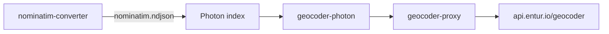

# Geocoder

Entur's geocoder: autocomplete and reverse geocoding for Norwegian stop places, addresses,
place names and points of interest. Two components - a patched
[Photon](https://github.com/entur/photon) search backend on OpenSearch, and a Ktor proxy in
front of it serving a v3 API plus a Pelias-compatible v2. The search index is built from a
Nominatim NDJSON dump produced by
[nominatim-converter](https://github.com/entur/nominatim-converter).



Public API: [developer.entur.no/apis/geocoder](https://developer.entur.no/apis/geocoder) -
`/v3/autocomplete`, `/v3/reverse`, `/v3/place`.

```bash
curl "https://api.entur.io/geocoder/v3/autocomplete?q=Oslo+S"
```

## Running locally

### Simple

One command converts every source with `converter-prod.json`, builds the index and starts
Photon. It downloads the whole country, so expect it to take a while.

```bash
./gradlew build

cd photon
./import/download-photon-jar.sh
./full-local-reimport-and-start.sh

# In another terminal - or run no.entur.geocoder.proxy.AppKt from your IDE
cd ../proxy && java -jar build/libs/proxy-all.jar
```

### Complex

The same steps one at a time, for a different config, or to skip the conversion and use what CI
built:

```bash
cd photon
./import/download-photon-jar.sh

# EITHER convert the data - import/config/converter-{prod,dev,local,sweden-test,denmark-test}.json
./import/create-nominatim-data.sh import/config/converter-local.json -z

# OR take the ndjson CI last built
./download-latest-nominatim-data.sh

./import/create-photon-data.sh nominatim.ndjson.gz

# OR skip both and take CI's finished index
rm -rf photon_data && ./download-latest-photon-data.sh

./photon-start.sh
```

### Trying it out

```bash
curl -s 'http://localhost:8080/v3/autocomplete?q=sk%C3%B8yen%20stasjon&limit=20'
curl -s 'http://localhost:8080/v3/reverse?lat=59.92&lon=10.67&radius=1&limit=10&layers=address,locality'

# v2 (Pelias-compatible) uses different parameter names
curl -s 'http://localhost:8080/v2/autocomplete?text=sk%C3%B8yen%20stasjon&size=20'
```

`&debug=true` also reveals the native Photon results with `importance` (input weight) and
`score` (weight calculated by Photon).

## Inspecting the index

Photon directly - category values are case-sensitive, so `layer.stopPlace` matches while
`layer.stopplace` silently returns nothing:

```bash
curl -s 'http://localhost:2322/api?q=Berglyveien&include=layer.stopPlace'
```

OpenSearch directly. Document ids are the entity id with `:` replaced by `-`
(`NSR-StopPlace-58404`, `KVE-PostalAddress-12191345`), not numeric OSM ids - `osm_id` is 0 for
NSR documents, so use `extra.id` from the API response as the key.

```bash
curl -s 'http://localhost:9201/photon/_mapping' | jq .   # available fields
curl -s 'http://localhost:9201/photon/_doc/NSR-StopPlace-58404' | jq .
```

Handy for checking what the converter actually wrote, e.g. the alt names a multimodal parent
inherited from its children:

```bash
$ curl -s 'http://localhost:9201/photon/_doc/NSR-StopPlace-58404' | jq -c '._source.name'
{"default":"Nationaltheatret","alt":"Nationaltheatret stasjon;Nasjonalteatret;Nationaltheatret"}
```

The same works against a pod in GKE via a port-forward:

```bash
kubectl --context dev port-forward <geocoder-photon-pod> -n geocoder 9201

ID=$(curl -s 'https://geocoder-photon.dev.entur.io/api?q=ullerud' \
  | jq -r '.features[0].properties.extra.id' | tr ':' '-')      # NSR-StopPlace-5496
curl -s "http://localhost:9201/photon/_doc/$ID" | jq -c "[._source.importance, ._source.name.default]"
[0.078586,"Ullerud"]
```

### Score vs. importance

`importance` is set by the converter in the Nominatim data; `score` is what Photon computes
from it at query time.

```bash
$ curl -s 'http://localhost:8080/v2/autocomplete?text=Oslo&debug=true&size=1' \
  | jq -c '.geocoding.debug.raw_data[] | [.localeTags.name.default, .infos.importance, .score]'
["Oslo",0.92,2.8717440524466067]
["Oslo S",0.538821,2.323909030548797]
["Oslo",0.27596,2.27596]
["Oslo lufthavn",0.550358,2.006965529061908]
```

<sub><sup>(Debug shows three more results than asked for, see `PhotonAutocompleteRequest.RESULT_PRUNING_HEADROOM`. Both numbers change with every index build, so treat them as illustrative. The two "Oslo" rows are the group of stop places and the locality.)</sup></sub>

## Deployment

All deployment runs from `main`. The daily import uses the `prod-approved` tag - remember to
move it when a commit is ready for production:

```
git tag -f prod-approved [sha]
git push origin prod-approved --force
```

| Workflow | Trigger | What it does |
| -------- | ------- | ------------ |
| [proxy.yml](https://github.com/entur/geocoder/actions/workflows/proxy.yml) | push to `main`, manual | Builds and deploys the proxy to dev; tst and prd need approval. Manual dispatch takes a target (`dev only` \| `dev → tst → prd` \| `tst → prd`) |
| [proxy-deploy.yml](https://github.com/entur/geocoder/actions/workflows/proxy-deploy.yml) | manual | Deploys an existing proxy image tag |
| [photon-scheduled.yml](https://github.com/entur/geocoder/actions/workflows/photon-scheduled.yml) | daily 06:27 UTC | Full import + build + deploy to tst → prd, no approval gates. Checks out `prod-approved` and updates the `latest-prod.txt` pointer |
| [photon.yml](https://github.com/entur/geocoder/actions/workflows/photon.yml) | manual | Import, build image, deploy (same targets; optional `config`, default `converter-prod.json`) |
| [photon-deploy.yml](https://github.com/entur/geocoder/actions/workflows/photon-deploy.yml) | manual | Deploys an existing Photon image tag |

All builds run acceptance tests after deployment, and most workflows post to Slack on failure.
The reusable [_generate-tag.yml](.github/workflows/_generate-tag.yml) and
[_deploy-and-test.yml](.github/workflows/_deploy-and-test.yml) workflows back the build and
deploy jobs; shared steps live as composite actions under
[.github/actions/](.github/actions/README.md).

### Other countries (dev only)

[photon-sweden-scheduled.yml](https://github.com/entur/geocoder/actions/workflows/photon-sweden-scheduled.yml)
runs a full Swedish import and deploy to dev every Monday at 05:27 UTC. It tracks `main` -
Sweden never reaches prod, so there is no `prod-approved` tag - and updates `latest.txt`. It
also keeps `photon-data-se/` inside the bucket's 90-day lifecycle window, so a running pod's
`photon_data.tar.gz` can't be deleted out from under it. The manual counterparts are
[photon-sweden.yml](https://github.com/entur/geocoder/actions/workflows/photon-sweden.yml) and
[proxy-sweden.yml](https://github.com/entur/geocoder/actions/workflows/proxy-sweden.yml).
Denmark has manual-only equivalents,
[photon-denmark.yml](https://github.com/entur/geocoder/actions/workflows/photon-denmark.yml) and
[proxy-denmark.yml](https://github.com/entur/geocoder/actions/workflows/proxy-denmark.yml).

### Scheduled checks

- [cache-data-sources.yml](https://github.com/entur/geocoder/actions/workflows/cache-data-sources.yml) - daily 03:00 UTC: downloads the third-party sources (matrikkel, stedsnavn, custom POIs from poiman) plus PostHog popular-stops, verifies size, and uploads them to `gs://ent-geocoder-prd/data-sources/`. The nightly import reads from this cache rather than hitting upstream directly.
- [monitor-photon-data.yml](https://github.com/entur/geocoder/actions/workflows/monitor-photon-data.yml) - daily 08:22 UTC: checks `photonImportDate` from the prod `/v2/info` endpoint and alerts Slack if the data is older than 50h.
- [api-docs.yml](https://github.com/entur/geocoder/actions/workflows/api-docs.yml) - lints both OpenAPI specs on every push/PR touching `proxy/docs/**`, `openapi3.yml` or `.spectral.yml`; on push to `main` publishes the v3 spec to [developer.entur.no/apis/geocoder](https://developer.entur.no/apis/geocoder) and `proxy/docs/` to [the docs portal](https://developer.entur.no/docs/open-services/geocoder). The v2 spec is linted but no longer published.

## Data artifacts (GCS)

Built artifacts live in the public bucket [gs://ent-geocoder-prd/](https://console.cloud.google.com/storage/browser/ent-geocoder-prd?project=ent-geocoder-prd):

| Prefix               | Contents                                      |
| -------------------- | --------------------------------------------- |
| `nominatim-data/`    | `nominatim.ndjson.gz` per build (+ `.sha256`) |
| `nominatim-data-se/` | Sweden variant                                |
| `photon-data/`       | `photon_data.tar.gz` per build (+ `.sha256`)  |
| `photon-data-se/`    | Sweden variant                                |
| `data-sources/`      | Daily-refreshed source files                  |

Each build writes to `<prefix>/<tag>/<filename>`. The `<tag>` is generated once and shared
between the docker image and the GCS upload, so `geocoder-photon:<tag>` always pairs with
`gs://.../photon-data/<tag>/photon_data.tar.gz`. Two pointer files at the prefix root track
recent builds: `latest.txt` (most recent build from any branch) and `latest-prod.txt` (most
recent build deployed to prod, written by `photon-scheduled.yml`).

The photon container fetches `photon_data.tar.gz` from `$PHOTON_DATA_URL` on startup, verifies
its `.sha256` sidecar, and writes a `photon_data/.ready` sentinel after extraction so in-place
restarts skip the download. CI derives the URL from the image tag in
[_deploy-and-test.yml](.github/workflows/_deploy-and-test.yml) and injects it into the helm
values; `templates/photon-data-validation.yaml` fails the render if it is missing.

### Rolling back

```bash
# See the current pointer
curl -s https://storage.googleapis.com/ent-geocoder-prd/photon-data/latest-prod.txt

# Re-deploy a known-good image - the data is paired automatically
gh workflow run photon-deploy.yml -f target='tst → prd' -f image_tag=<previous-tag>
```

### 90-day lifecycle rule

Applied once per bucket. The `matchesSuffix` filter spares the `latest*.txt` pointer files.

```json
{
  "lifecycle": {
    "rule": [
      {
        "action": {"type": "Delete"},
        "condition": {
          "age": 90,
          "matchesPrefix": ["nominatim-data", "photon-data"],
          "matchesSuffix": [".gz", ".sha256"]
        }
      }
    ]
  }
}
```

## Releasing a patched Photon

Ranking happens inside Photon, so most search tuning lands in the fork rather than here.

1. Make the change in a checkout of [komoot/photon](https://github.com/komoot/photon) and build it with `./gradlew build`.
2. Create a tag and push it to [entur/photon](https://github.com/entur/photon) with `git push --tags entur`.
3. Draft a release at [entur/photon/releases/new](https://github.com/entur/photon/releases/new), select the tag, attach `photon-<tag>.jar` from Photon's `target/`, check "Set as a pre-release" and publish.
4. Copy the asset link and update `PHOTON_JAR` in [photon/import/download-photon-jar.sh](photon/import/download-photon-jar.sh).
5. Push, then run [photon.yml](https://github.com/entur/geocoder/actions/workflows/photon.yml) with target `dev only`.

## Links

**Dashboards** - [Photon metrics](https://grafana.entur.org/d/VpZ62_2Wk/jvm-overview-prometheus?orgId=1&var-datasource=000000002&var-label=app&var-name=geocoder-photon&var-prometheus_group=kub-ent-dev-001&from=now-6h&to=now) ·
[Proxy metrics](https://grafana.entur.org/d/VpZ62_2Wk/jvm-overview-prometheus?orgId=1&var-datasource=000000002&var-label=app&var-name=geocoder-proxy&var-prometheus_group=kub-ent-dev-001&from=now-6h&to=now)

**Ours**

- [nominatim-converter](https://github.com/entur/nominatim-converter) - builds the index this proxy queries. Importance lives in `src/common/importance.rs`, categories in `src/common/category.rs`
- [entur/photon](https://github.com/entur/photon) - the patched fork that does the actual ranking. [PhotonDocSerializer](https://github.com/entur/photon/blob/master/src/main/java/de/komoot/photon/opensearch/PhotonDocSerializer.java) decides which name fields get indexed and at what priority
- [geocoder-acceptance-tests](https://github.com/entur/geocoder-acceptance-tests)
- [bau](https://github.com/entur/bau) - v2 vs v3 comparison tool ([hosted](https://ent-bau-dev.web.app/))

**External**

- [photon](https://photon.komoot.io/) and the [photon pelias adapter](https://github.com/stadtulm/photon-pelias-adapter)
- [OSM dumps for photon](https://download1.graphhopper.com/public/experimental/extracts/by-country-code/no/) from graphhopper
- [Nominatim](https://github.com/osm-search/Nominatim) and its [database layout](https://nominatim.org/release-docs/latest/develop/Database-Layout/)
