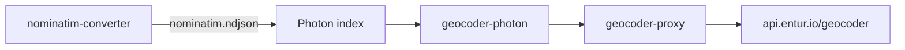

# Geocoder

Entur's geocoder: autocomplete and reverse geocoding for Norwegian stop places, addresses,
place names and points of interest. Two components - a patched
[Photon](https://github.com/entur/photon) search backend on OpenSearch, and a Ktor proxy in
front of it serving a v3 API plus a Pelias-compatible v2. The search index is built from a
Nominatim NDJSON dump produced by
[nominatim-converter](https://github.com/entur/nominatim-converter).


```mermaid
flowchart LR
    A[nominatim-converter] -->|nominatim.ndjson| B[Photon index]
    B --> C[geocoder-photon]
    C --> D[geocoder-proxy]
    D --> E[api.entur.io/geocoder]
```

Public API: [developer.entur.no/apis/geocoder](https://developer.entur.no/apis/geocoder) -
`/v3/autocomplete`, `/v3/reverse`, `/v3/place`.

```bash
curl "https://api.entur.io/geocoder/v3/autocomplete?q=Oslo+S"
```

## Running locally

### Simple

One command converts every source with `converter-prod.json`, builds the index and starts
Photon. It downloads the whole country, so expect it to take a while.

```bash
cd photon
./import/download-photon-jar.sh
./full-local-reimport-and-start.sh

# In another terminal, from the repo root - or run no.entur.geocoder.proxy.AppKt from your IDE
./gradlew :proxy:run
```

Started from a console the proxy talks to `http://localhost:2322`; set `PHOTON_URL` to point it
somewhere else.

### Complex

The same steps one at a time, for a different config, or to skip the conversion and use what CI
built:

```bash
cd photon
./import/download-photon-jar.sh

# EITHER convert the data - import/config/converter-{prod,dev,local,sweden-test,denmark-test}.json
./import/create-nominatim-data.sh import/config/converter-local.json -z

# OR take the ndjson CI last built
./download-latest-nominatim-data.sh

./import/create-photon-data.sh nominatim.ndjson.gz

# OR skip both and take CI's finished index
rm -rf photon_data && ./download-latest-photon-data.sh

./photon-start.sh
```

Both download scripts take `[suffix] [tag]` and default to `latest-prod`, the index prd serves.
Pass `latest` for the newest build of any kind, or a full tag. Only the Norwegian prefixes have
a `latest-prod` pointer; with a suffix the scripts default to `latest`. `latest-prod` was imported with
prd's `photon.jar`, which can be older than the one `download-photon-jar.sh` pins; if Photon
refuses to open the index, that is why - take a data tag from the same build as your jar.

### Trying it out

```bash
curl -s 'http://localhost:8080/v3/autocomplete?q=sk%C3%B8yen%20stasjon&limit=20'
curl -s 'http://localhost:8080/v3/reverse?lat=59.92&lon=10.67&radius=1&limit=10&layers=address,locality'

# v2 (Pelias-compatible) uses different parameter names
curl -s 'http://localhost:8080/v2/autocomplete?text=sk%C3%B8yen%20stasjon&size=20'
```

`&debug=true` also reveals the native Photon results with `importance` (input weight) and
`score` (weight calculated by Photon).

## Inspecting the index

Photon directly - category values are case-sensitive, so `layer.stopPlace` matches while
`layer.stopplace` silently returns nothing:

```bash
curl -s 'http://localhost:2322/api?q=Berglyveien&include=layer.stopPlace'
```

OpenSearch directly. Document ids are the entity id with `:` replaced by `-`
(`NSR-StopPlace-58404`, `KVE-PostalAddress-12191345`), not numeric OSM ids - `osm_id` is 0 for
NSR documents, so use `extra.id` from the API response as the key.

```bash
curl -s 'http://localhost:9201/photon/_mapping' | jq .   # available fields
curl -s 'http://localhost:9201/photon/_doc/NSR-StopPlace-58404' | jq .
```

Handy for checking what the converter actually wrote, e.g. the alt names a multimodal parent
inherited from its children:

```bash
$ curl -s 'http://localhost:9201/photon/_doc/NSR-StopPlace-58404' | jq -c '._source.name'
{"default":"Nationaltheatret","alt":"Nationaltheatret stasjon;Nasjonalteatret;Nationaltheatret"}
```

The same works against a pod in GKE via a port-forward:

```bash
kubectl --context dev port-forward <geocoder-photon-pod> -n geocoder 9201

ID=$(curl -s 'https://geocoder-photon.dev.entur.io/api?q=ullerud' \
  | jq -r '.features[0].properties.extra.id' | tr ':' '-')      # NSR-StopPlace-5496
curl -s "http://localhost:9201/photon/_doc/$ID" | jq -c "[._source.importance, ._source.name.default]"
[0.078586,"Ullerud"]
```

### Score vs. importance

`importance` is set by the converter in the Nominatim data; `score` is what Photon computes
from it at query time.

```bash
$ curl -s 'http://localhost:8080/v2/autocomplete?text=Oslo&debug=true&size=1' \
  | jq -c '.geocoding.debug.raw_data[] | [.localeTags.name.default, .infos.importance, .score]'
["Oslo",0.92,2.8717440524466067]
["Oslo S",0.538821,2.323909030548797]
["Oslo",0.27596,2.27596]
["Oslo lufthavn",0.550358,2.006965529061908]
```

<sub><sup>(Debug shows three more results than asked for, see `PhotonAutocompleteRequest.RESULT_PRUNING_HEADROOM`. Both numbers change with every index build, so treat them as illustrative. The two "Oslo" rows are the group of stop places and the locality.)</sup></sub>

## Deployment

All deployment runs from `main`. The scheduled imports are the exception, and they build no
image. The daily one reads the build prd is running, re-imports the index from the commit named
in its image tag, and rolls the pods onto the new data. A merge to `main` therefore does not reach the unattended
nightly on its own - to promote code into it, run `photon.yml` and approve it through to prd,
and every night after that refreshes the data for the new commit.
`photon-deploy.yml` promotes an image you already built, without a fresh import. The import
jobs run entirely from prd's commit, build actions included, so a change under
`.github/actions/` that the import uses also needs a promote before the nightly picks it up;
only the chart and the acceptance tests come from `main` every night. To see what prod is
missing:

```bash
git log --oneline "$(curl -s https://storage.googleapis.com/ent-geocoder-prd/photon-data/latest-prod.txt \
  | sed 's/.*-SHA//')"..origin/main
```

| Workflow | Trigger | What it does |
| -------- | ------- | ------------ |
| [proxy.yml](https://github.com/entur/geocoder/actions/workflows/proxy.yml) | push to `main`, manual | Builds and deploys the proxy to dev; tst and prd need approval. Manual dispatch takes a target (`dev only` \| `dev → tst → prd` \| `tst → prd`) |
| [proxy-deploy.yml](https://github.com/entur/geocoder/actions/workflows/proxy-deploy.yml) | manual | Deploys an existing proxy image tag |
| [photon-scheduled.yml](https://github.com/entur/geocoder/actions/workflows/photon-scheduled.yml) | daily 06:27 UTC | Re-imports the index for the build prd runs and deploys it to tst → prd, no approval gates and no new image. tst gets prd's image too, so it is a prd clone rather than a preview of `main`. Manual dispatch takes an optional `image_tag`, which also deploys that image and therefore needs the usual tst and prd approvals |
| [photon.yml](https://github.com/entur/geocoder/actions/workflows/photon.yml) | manual | Import, build image, deploy (same targets, default `dev → tst → prd`; optional `config`, default `converter-prod.json`). tst and prd need approval |
| [photon-deploy.yml](https://github.com/entur/geocoder/actions/workflows/photon-deploy.yml) | manual | Deploys an existing Photon image tag, optionally pairing it with a different `photon_data_tag`; tst and prd need approval |

All builds run acceptance tests after deployment, and most workflows post to Slack on failure.
The reusable [_resolve-release.yml](.github/workflows/_resolve-release.yml),
[_generate-tag.yml](.github/workflows/_generate-tag.yml) and
[_deploy-and-test.yml](.github/workflows/_deploy-and-test.yml) workflows back the resolve, build and
deploy jobs; shared steps live as composite actions under
[.github/actions/](.github/actions/README.md).

### Other countries (dev only)

[photon-sweden-scheduled.yml](https://github.com/entur/geocoder/actions/workflows/photon-sweden-scheduled.yml)
re-imports the Swedish index every Monday at 05:27 UTC the same way the Norwegian nightly
does, for the build dev runs: no new image, and a merge to `main` (or any change on the import
side: `.github/actions/`, the converter pin, `download-photon-jar.sh`, `synonyms-se.json`)
reaches Sweden only when `photon-sweden.yml` builds an image from it, with "Download data" or
"Use existing data" and the weekly's `nominatim-data-se` tag. "Deploy specified Photon image"
only moves the image, and takes a `photon_data_tag` for the same reason `photon-deploy.yml`
does. The weekly run also keeps `photon-data-se/` inside the bucket's 90-day lifecycle window,
so a running pod's `photon_data.tar.gz` can't be deleted out from under it. The manual
counterparts are
[photon-sweden.yml](https://github.com/entur/geocoder/actions/workflows/photon-sweden.yml) and
[proxy-sweden.yml](https://github.com/entur/geocoder/actions/workflows/proxy-sweden.yml).
Denmark has manual-only equivalents,
[photon-denmark.yml](https://github.com/entur/geocoder/actions/workflows/photon-denmark.yml) and
[proxy-denmark.yml](https://github.com/entur/geocoder/actions/workflows/proxy-denmark.yml), and
no scheduled refresh: `photon-data-dk/` expires 90 days after the last run, after which the pod
cannot restart until `photon-denmark.yml` is run again.

### Scheduled checks

- [cache-data-sources.yml](https://github.com/entur/geocoder/actions/workflows/cache-data-sources.yml) - daily 03:00 UTC: downloads the third-party sources (matrikkel, stedsnavn, custom POIs from poiman) plus PostHog popular-stops, verifies size, and uploads them to `gs://ent-geocoder-prd/data-sources/`. The nightly import reads from this cache rather than hitting upstream directly.
- [monitor-photon-data.yml](https://github.com/entur/geocoder/actions/workflows/monitor-photon-data.yml) - daily 08:22 UTC: checks `photonImportDate` from the prod `/v2/info` endpoint and alerts Slack if the data is older than 50h.
- [api-docs.yml](https://github.com/entur/geocoder/actions/workflows/api-docs.yml) - lints both OpenAPI specs on every push/PR touching `proxy/docs/**`, `openapi3.yml` or `.spectral.yml`; on push to `main` publishes the v3 spec to [developer.entur.no/apis/geocoder](https://developer.entur.no/apis/geocoder) and `proxy/docs/` to [the docs portal](https://developer.entur.no/docs/open-services/geocoder). The v2 spec is linted but no longer published.

## Data artifacts (GCS)

Built artifacts live in the public bucket [gs://ent-geocoder-prd/](https://console.cloud.google.com/storage/browser/ent-geocoder-prd?project=ent-geocoder-prd):

| Prefix               | Contents                                      |
| -------------------- | --------------------------------------------- |
| `nominatim-data/`    | `nominatim.ndjson.gz` per build (+ `.sha256`) |
| `nominatim-data-se/` | Sweden variant                                |
| `photon-data/`       | `photon_data.tar.gz` per build (+ `.sha256`)  |
| `photon-data-se/`    | Sweden variant                                |
| `data-sources/`      | Daily-refreshed source files                  |

Each build writes to `<prefix>/<tag>/<filename>`. A full build generates one tag and gives it
to both the docker image and the GCS upload, so `geocoder-photon:<tag>` pairs with
`gs://.../photon-data/<tag>/photon_data.tar.gz`. The nightly breaks that pairing on purpose:
it uploads new data under a new tag while prd keeps the image it already runs. Either way the
tag's `-SHA` suffix names the commit the data was imported from.

Two pointer files at the prefix root track recent builds: `latest.txt` (most recent build,
written by every build) and `latest-prod.txt` (the data prd is serving, written by
`photon-scheduled.yml` once the prd deploy succeeds). Both are informational - nothing reads
them to decide what to build, and `latest-prod.txt` lags until the next nightly after a manual
promote, since only the nightly writes it. The authoritative answer is on the running pods:

```bash
kubectl --context prd -n geocoder get deployment geocoder-photon \
  -o jsonpath='{.spec.template.spec.initContainers[*].env[?(@.name=="PHOTON_DATA_URL")].value}'
```

A `fetch-photon-data` init container downloads `photon_data.tar.gz` from `$PHOTON_DATA_URL`,
verifies its `.sha256` sidecar, and extracts it into a shared `emptyDir` the distroless photon
container serves from (so the runtime image needs no shell/curl/tar). CI resolves the URL in
[_deploy-and-test.yml](.github/workflows/_deploy-and-test.yml) from `photon_data_tag`, falling
back to the image tag, and injects it into the helm values;
`templates/photon-data-validation.yaml` fails the render if it is missing. The URL lives in the
pod template, so moving it is what rolls the pods onto new data.

### Rolling back

Image and data roll independently.

```bash
# What prd is pinned to (image) and serving (data)
kubectl --context prd -n geocoder get deployment geocoder-photon -o jsonpath='\
{.spec.template.spec.containers[0].image}{"\n"}\
{.spec.template.spec.initContainers[*].env[?(@.name=="PHOTON_DATA_URL")].value}{"\n"}'

# Bad data, good image: re-deploy the running image with an earlier index
gh workflow run photon-deploy.yml -f target='tst → prd' \
  -f image_tag=<current-tag> -f photon_data_tag=<previous-data-tag>

# Bad image: go back to a known-good one. Drop photon_data_tag only if that image's own
# data is still inside the 90-day window; otherwise name a data tag its jar can read.
gh workflow run photon-deploy.yml -f target='tst → prd' -f image_tag=<previous-tag>
```

The next nightly follows whatever image prd ends up on. Sweden works the same way with
`photon-sweden.yml` in "Deploy specified Photon image" mode, its `photon_image_tag` and
`photon_data_tag`, and `--context dev` with `geocoder-photon-se`.

### 90-day lifecycle rule

Applied once per bucket. The `matchesSuffix` filter spares the `latest*.txt` pointer files.

```json
{
  "lifecycle": {
    "rule": [
      {
        "action": {"type": "Delete"},
        "condition": {
          "age": 90,
          "matchesPrefix": ["nominatim-data", "photon-data"],
          "matchesSuffix": [".gz", ".sha256"]
        }
      }
    ]
  }
}
```

## Query synonyms

[photon/synonyms.json](photon/synonyms.json) goes to `serve` via `-synonym-file`;
`synonyms-se.json` / `synonyms-dk.json` are picked by the `SYNONYM_FILE` build arg. Applied at
query time and baked into the image, so editing one needs no reimport but does need a `photon.yml`
run promoted to prd - the nightly reuses prd's image and will not pick it up.

- Single tokens, no spaces. CI rejects the rest.
- `gt` and `gt.` are separate terms, both needed.
- Only add a rule that measurably changes a result. Prefixes (`pl`) and one-character variants
  (`ferje`/`ferge`) already match; `vgs` and `stasjon,station` were measured and rejected.
- Compounds are one token, so `kirkevn` is out of reach. That needs
  [photon#97](https://github.com/komoot/photon/issues/97).

## Releasing a patched Photon

Ranking happens inside Photon, so most search tuning lands in the fork rather than here.

1. Make the change in a checkout of [komoot/photon](https://github.com/komoot/photon) and build it with `./gradlew build`.
2. Create a tag and push it to [entur/photon](https://github.com/entur/photon) with `git push --tags entur`.
3. Draft a release at [entur/photon/releases/new](https://github.com/entur/photon/releases/new), select the tag, attach `photon-<tag>.jar` from Photon's `target/`, check "Set as a pre-release" and publish.
4. Copy the asset link and update `PHOTON_JAR` and `PHOTON_JAR_SHA256` in [photon/import/download-photon-jar.sh](photon/import/download-photon-jar.sh).
5. Push, then run [photon.yml](https://github.com/entur/geocoder/actions/workflows/photon.yml) with target `dev only`.
6. Once dev looks right, promote it to prd. The nightly imports from the commit prd runs, so an unpromoted jar never reaches production.

## Links

**Metrics** - other teams' recording rules select on Spring Boot's labels for `http.server.requests` (`uri`, `status`, `method`, `outcome`, `exception`). Photon's Javalin plugin emits those names already, but Ktor calls the route label `route`, so the proxy remaps it in [RequestMetrics.kt](proxy/src/main/kotlin/no/entur/geocoder/proxy/metrics/RequestMetrics.kt).

**Dashboards** - [Photon metrics](https://grafana.entur.org/d/VpZ62_2Wk/jvm-overview-prometheus?orgId=1&var-datasource=000000002&var-label=app&var-name=geocoder-photon&var-prometheus_group=kub-ent-dev-001&from=now-6h&to=now) ·
[Proxy metrics](https://grafana.entur.org/d/VpZ62_2Wk/jvm-overview-prometheus?orgId=1&var-datasource=000000002&var-label=app&var-name=geocoder-proxy&var-prometheus_group=kub-ent-dev-001&from=now-6h&to=now)

**Ours**

- [nominatim-converter](https://github.com/entur/nominatim-converter) - builds the index this proxy queries. Importance lives in `src/common/importance.rs`, categories in `src/common/category.rs`
- [entur/photon](https://github.com/entur/photon) - the patched fork that does the actual ranking. [PhotonDocSerializer](https://github.com/entur/photon/blob/master/src/main/java/de/komoot/photon/opensearch/PhotonDocSerializer.java) decides which name fields get indexed and at what priority
- [geocoder-acceptance-tests](https://github.com/entur/geocoder-acceptance-tests)
- [bau](https://github.com/entur/bau) - v2 vs v3 comparison tool ([hosted](https://ent-bau-dev.web.app/))

**External**

- [photon](https://photon.komoot.io/) and the [photon pelias adapter](https://github.com/stadtulm/photon-pelias-adapter)
- [OSM dumps for photon](https://download1.graphhopper.com/public/experimental/extracts/by-country-code/no/) from graphhopper
- [Nominatim](https://github.com/osm-search/Nominatim) and its [database layout](https://nominatim.org/release-docs/latest/develop/Database-Layout/)
